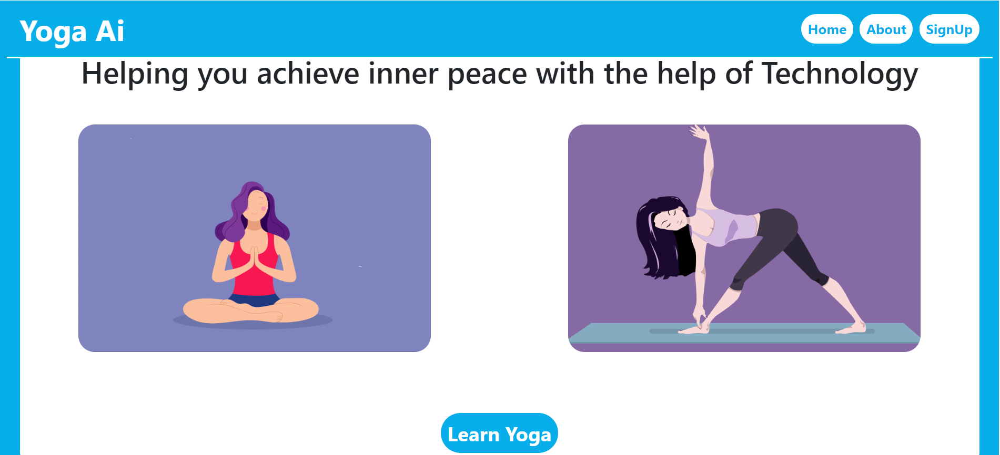
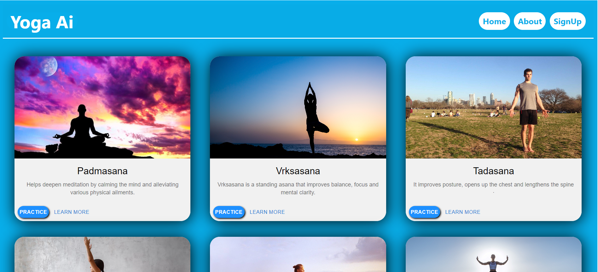
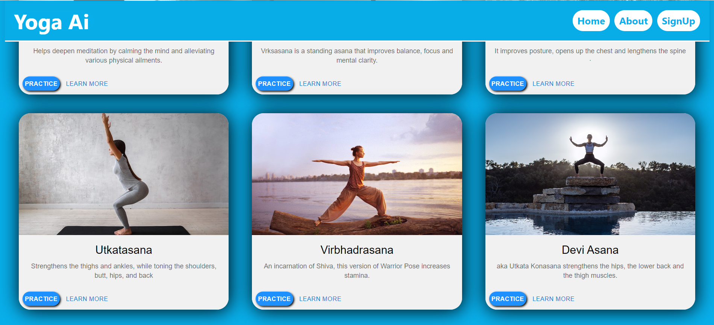

# Yoga AI Assistant

<div align="center">



**An intelligent yoga assistant powered by TensorFlow.js and PoseNet, providing real-time pose detection and feedback**

</div>

## 📋 Overview

Yoga AI Assistant is a React-based web application that uses machine learning to help users perfect their yoga practice. The application leverages TensorFlow.js and PoseNet to analyze the user's posture in real-time through their webcam, comparing it with the correct form and providing instant visual and audio feedback for improvement.

## ✨ Features

- **Real-time Pose Detection**: Utilizes PoseNet to accurately identify and analyze 6 different yoga poses
- **Intelligent Feedback System**: Provides immediate visual cues and vocal guidance to correct your posture
- **Detailed Pose Analysis**: Breaks down the analysis by body parts (arms, wrists, thighs, legs) for precise feedback
- **Comprehensive Pose Library**: Includes popular poses like Padmasana (Lotus), Vrksasana (Tree), Tadasana (Mountain), and more
- **Responsive Design**: Works seamlessly across desktop and mobile devices
- **User-friendly Interface**: Intuitive navigation and clear visual instructions

## 🖼️ Screenshots

### Home Page


### Pose Selection Page



### Pose Detection and Correction Feedback


## 🚀 Technologies Used

- **Frontend**: React.js, React Router
- **UI Components**: Material-UI, React Bootstrap
- **Machine Learning**: TensorFlow.js, PoseNet model
- **Media Handling**: React Webcam
- **Styling**: CSS3, Bootstrap

## 🛠️ Getting Started

### Prerequisites

Ensure you have the following installed on your system:

- Node.js (v14.0 or later)
- npm (v6.0 or later)
- A modern web browser with webcam access

### Installation

1. Clone the repository:

   ```bash
   git clone https://github.com/yourusername/Yoga_AI_reactJS.git
   ```

2. Navigate to the project directory:

   ```bash
   cd Yoga_AI_reactJS
   ```

3. Install the dependencies:

   ```bash
   npm install
   ```

4. Start the development server:

   ```bash
   npm start
   ```

5. Open your browser and visit [http://localhost:3000](http://localhost:3000)

## 📖 How to Use

1. From the home page, click on "Get Started" to access the pose selection page
2. Browse through the available yoga poses and select one to practice
3. Allow camera access when prompted
4. Position yourself in front of the camera and attempt to match the selected pose
5. The application will analyze your posture in real-time and provide feedback
6. Follow the on-screen guidance to correct your form
7. Practice regularly to improve your yoga technique!

## 📚 Available Poses

The application currently supports the following yoga poses:

- **Padmasana** (Lotus Pose) - Helps deepen meditation by calming the mind
- **Vrksasana** (Tree Pose) - Improves balance, focus, and mental clarity
- **Tadasana** (Mountain Pose) - Improves posture and lengthens the spine
- **Utkatasana** (Chair Pose) - Strengthens thighs, ankles, and tones shoulders
- **Virbhadrasana** (Warrior Pose) - Increases stamina and overall body strength
- **Devi Asana** (Goddess Pose) - Strengthens hips, lower back, and thigh muscles

## 🧠 How It Works

Yoga AI Assistant uses TensorFlow.js and the PoseNet model to detect key points on the human body through the webcam. The application:

1. Captures video input from your webcam
2. Processes each frame through the PoseNet model to identify 17 key body points
3. Compares the angles and positions of these points with the correct pose
4. Provides real-time feedback on which body parts need adjustment
5. Displays visual indicators for correct and incorrect posture

## 🤝 Contributing

Contributions are welcome! If you'd like to contribute to this project, please follow these steps:

1. Fork the repository
2. Create a new branch (`git checkout -b feature/amazing-feature`)
3. Make your changes
4. Commit your changes (`git commit -m 'Add some amazing feature'`)
5. Push to the branch (`git push origin feature/amazing-feature`)
6. Open a Pull Request

## 📄 License

This project is licensed under the MIT License - see the LICENSE file for details.

## 🙏 Acknowledgments

- TensorFlow.js team for the amazing machine learning library
- PoseNet developers for the human pose estimation model
- React team for the frontend framework
- All contributors who have helped improve this project

## 📞 Contact

If you have any questions or suggestions, feel free to reach out or open an issue on GitHub.

---

<div align="center">

**Made with ❤️ for yoga enthusiasts everywhere**

</div>
